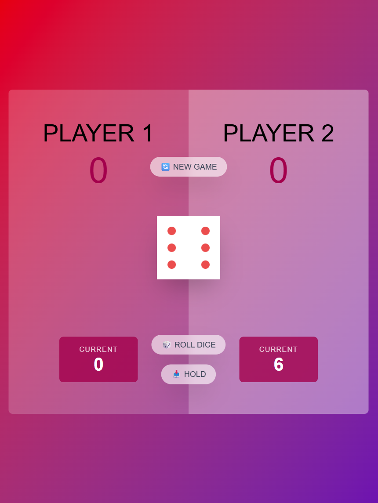
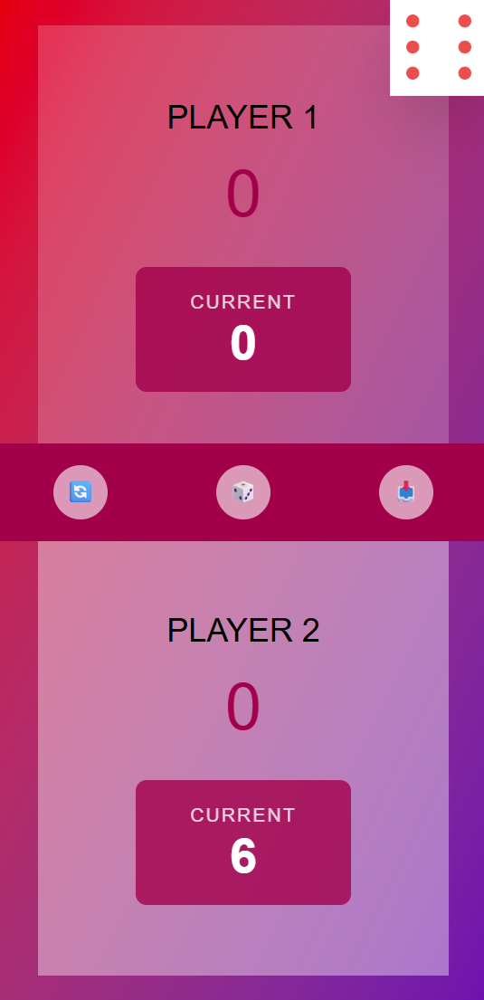
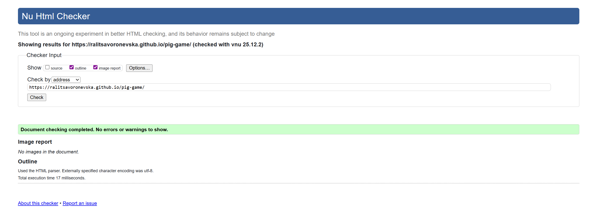
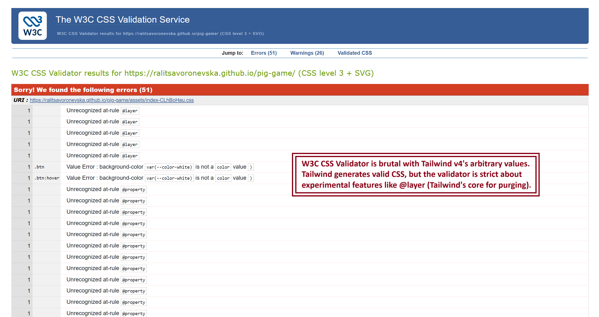
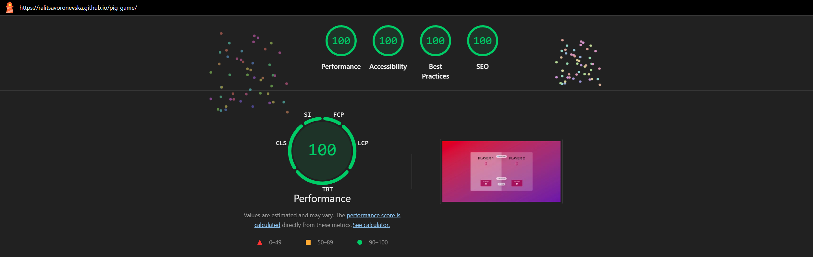
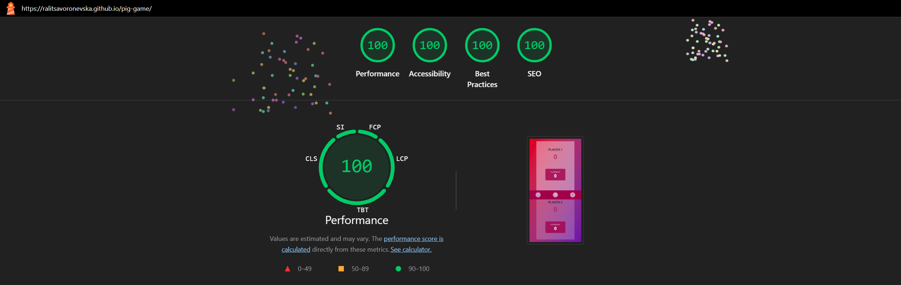
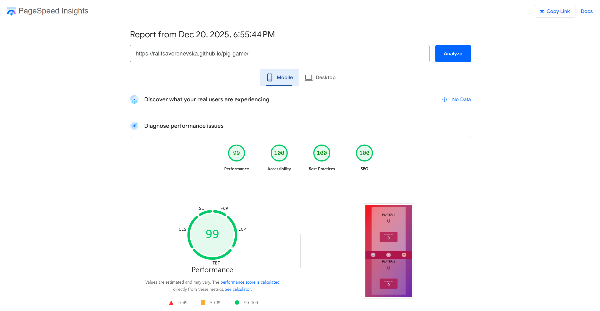
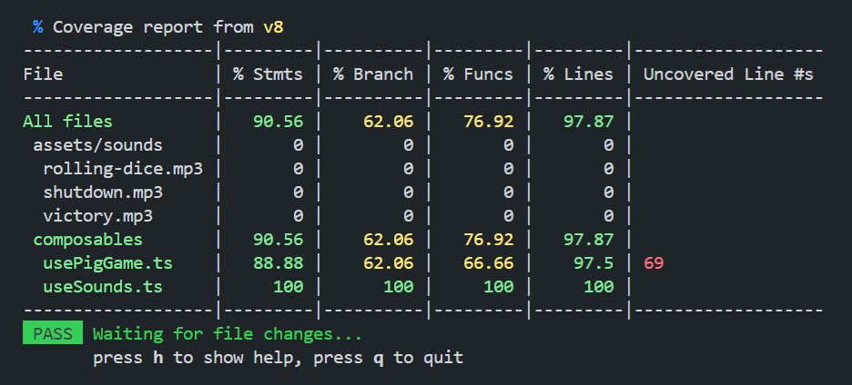

# 🎲 Pig Game

I've built a small yet classic dice game for two players by following [The Complete JavaScript Course 2025: From Zero to Expert!](https://www.udemy.com/course/the-complete-javascript-course/) Udemy Couse. Give it a go! Roll the dice and try your luck 🙃

📝 [CodePen](https://codepen.io/ralitsavoronevska/pen/MYyqdXe/)
🔗[Live GitHub Preview](https://ralitsavoronevska.github.io/pig-game/)

<details>
<summary>📸 Screenshots</summary>

## 🖥️ Desktop preview:


<table width="100%">
  <thead>
    <tr>
      <th width="65%" style="border: none;">📱 Tablet Preview</th>
      <th width="35%" style="border: none;">📱 Mobile Preview</th>
    </tr>
  </thead>
  <tbody>
    <tr>
      <td width="65%"></td>
      <td width="35%"></td>
    </tr>
  </tbody>
</table>

# 🏅 W3C HTML Validator


<br>

# 🏅 W3C CSS Validator


<br>

# 🌈 Chrome LightHouse Audit

Desktop:



<br>

Mobile:



<br>

# ⚡ PageSpeed Insights Results

Desktop:


<br>

Mobile:



</details>

<br/>


## Basic dice game rules

Goal: Be the first player to reach 100 points or more.                                                                                                             
Setup: Use one or two dice and a way to keep score.                                                                                                                
Taking turns: Players take turns rolling the die (or dice).                                                                                                        

### Rolling:                                                                                                                                                       

Single die: On each roll, add the number to a running total for the turn.                                                                                          
Two dice: On each roll, add the sum of the two dice to a running total.                                                                                            
Deciding to roll again: After each roll, you can choose to either stop and add the turn's total to your score, or roll again for more points.                      

### Losing your turn:                                                                                                                                              

Single die: If you roll a 1, your turn ends, and you score zero for that turn.                                                                                     
Two dice: If you roll a 1 on either die, your turn ends, and you score zero for that turn.                                                                         
Two dice (double 1s): If you roll "snake eyes" (two 1s), your turn ends, and you lose all points you have accumulated during that turn. In some variations, your entire score is reset to zero.                                                                                                                                     
Winning: The first player to reach the target score (e.g., 100) wins.                                                                                              

<br>        
                                                                                                                                              
# 🛠️ Built with:

                                                                                                                                                
                                                                                                                                               
🔨 Fully Responsive, Mobile First Approach, Transitions, Animations, Flex Layout                                                    
⛏️ [Google Font: Nunito](https://fonts.google.com/specimen/Nunito/)                                                                  



# ✨ Features:
⚡ Vue 3 + Vite + TypeScript                                                                                                                         
🎨 Tailwind CSS v4                    
😶‍🌫️ Unit Tests with Vitest                                                                                                             
🔊 Sound effects with Howler.js                                                                                                                                      

# 🧰 Online resources and tools:                                                                                
🖼️ [Photopea [Online Photo Editor]](https://www.photopea.com/)        
<br>                                                                            

# 🌐 Browser Support:
(Last updated and tested: 20/12/2025)                                                                                                            
🌟 Chrome 143.0.7499.170 (64-bit)                                                                                                           
🦊 Firefox 146.0.1 (64-bit)                                                                                                                 
🏴‍☠️ Opera 125.0.5729.49 (64-bit)                                                                                                        
🪟 Edge 143.0.3650.96 (64-bit)                                                                                                                   

# 🧪 Online Validators:
✔️ [W3C HTML Validator](https://validator.w3.org/)                                                                                               
✔️ [W3C CSS Validator](https://jigsaw.w3.org/css-validator/)                                                                                     
💡 [LightHouse Audit](https://developers.google.com/web/tools/lighthouse/)                                                                       
⚡ [PageSpeed Insights Audit](https://pagespeed.web.dev/)         
⭐ [WebPageTest](https://www.catchpoint.com/webpagetest/)                                                                                                 


## Install
`cd` to project's dir and run `npm install`

## Vite builds
Vite is next Generation Frontend Tooling featuring unbundled web-development

## Hot-reloads for development
Start the development server on http://localhost:5137:
```bash
$ npm run dev
```

## Builds and minifies for production
```bash
$ npm run build
```

## Serves recently built app
```bash
$ npm run preview
```

<br>

# 🌟 Inspiration & Credits:                                          
▶️ [The Complete JavaScript Course 2025: From Zero to Expert!](https://www.udemy.com/course/the-complete-javascript-course/)                      
🪄 [Grok 4](https://grok.com/)                
📢 [Sound effetcs from Pixaby](https://pixabay.com/sound-effects/)                                                                                                       

---
  
🙌 Thanks for checking out my project! More coming 🔜.                                                                                           
Stay tuned 🚀 and don't forget to give the project a star!                                                                                       
⭐ Made with lots of 💗, ☕, and a sprinkle of ✨ by Ralitsa Voronevska!                                                                                